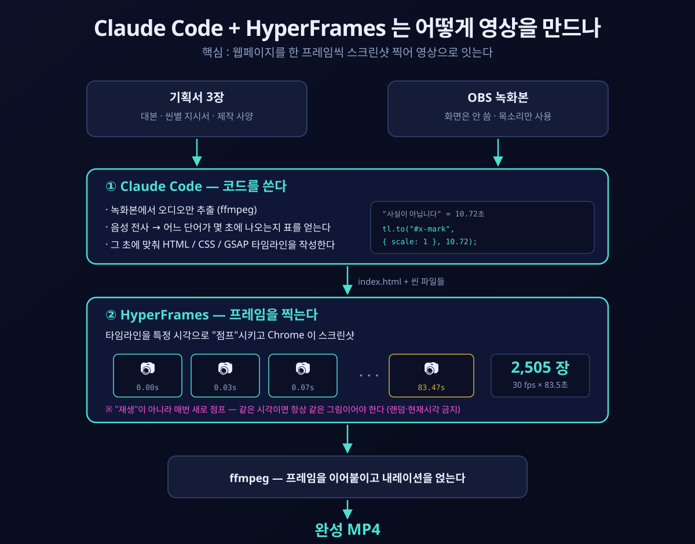

# HyperFrames 한국어 스타터 키트

**내레이션을 녹음해 두면, 목소리에 맞춰 움직이는 모션그래픽 영상을 만들어 주는 키트입니다.**
코딩을 할 줄 몰라도 됩니다. Claude Code 에게 말로 시키면 됩니다.

> 필로소피 AI 교육 · Claude Code + HyperFrames 강의용
>
> 비공식 커뮤니티 자료입니다. Anthropic(Claude) 및 HeyGen(HyperFrames)과
> 공식적인 제휴·후원 관계가 없습니다. 각 이름은 해당 소유자의 상표입니다.



---

## 원리 — 왜 이게 되는가

핵심은 한 문장입니다. **HyperFrames 는 웹페이지를 한 프레임씩 스크린샷 찍어서 영상으로 잇습니다.**

영상은 1초에 30장의 정지 이미지입니다. HyperFrames 는 그 한 장 한 장을 웹페이지
스크린샷으로 만듭니다. 웹페이지 안에는 "몇 초에 무엇이 어떻게 움직인다" 가 코드로 적혀 있습니다.

```javascript
// 0.18초부터 3.88초 동안 Y축으로 698도 회전 (동전이 팽이처럼 돈다)
tl.fromTo("#coin", { rotationY: 0 },
          { rotationY: 698, duration: 3.88, ease: "none" }, 0.18);

// 4.06초 — "그 순간에는" 하고 말하는 순간 감속해서 정면으로
tl.to("#coin", { rotationY: 1044, duration: 1.74, ease: "power3.out" }, 4.06);
```

렌더러는 이 타임라인을 **재생하지 않고 "점프"합니다.** 41.13초 프레임이 필요하면
타임라인을 41.13초로 옮겨놓고 찍습니다. 그래서 규칙이 하나 있습니다 —
**같은 시각이면 항상 같은 그림**이어야 합니다. `Math.random()` 이나 "현재 시각" 을
쓰면 프레임마다 결과가 달라져서 영상이 깨집니다.

**여기서 Claude 의 역할이 나옵니다.** 모션그래픽이 *코딩 문제*로 바뀌었습니다.
After Effects 에서 키프레임을 클릭해 찍는 대신, 위 같은 코드를 쓰면 됩니다.
그리고 코드 쓰는 건 Claude 가 잘하는 일입니다.

**전사(음성→텍스트)가 필수인 이유도 여기서 나옵니다.** 타임라인은 전부 숫자(초)입니다.
Whisper 가 "말 → 초" 대응표를 만들어 주니까, *"'사실이 아닙니다' 할 때 X 표시 띄워줘"*
라는 말이 `10.72` 라는 정확한 숫자가 됩니다.

---

## 준비물 (처음 한 번만)

**전부 미리 설치해 두세요.** Claude 에게 맡겨도 되지만, 설치 도중 권한 창이
여러 번 뜨고 중간에 막히는 경우가 많습니다. 아래 순서대로 먼저 깔아 두시면
전체 과정이 훨씬 매끄럽습니다. 다 합쳐서 10~15분 정도 걸립니다.

**순서가 중요합니다** — 2번(스킬 설치)은 1번(Node.js)이 있어야 실행됩니다.

### 1. Node.js — 필수, 제일 먼저

다른 모든 도구가 이 위에서 돌아갑니다.

1. https://nodejs.org 접속
2. **"LTS"** 라고 적힌 큰 버튼을 클릭해서 내려받습니다 (숫자 버전은 신경 쓰지 마세요)
3. 내려받은 설치 파일을 실행하고 **Next 를 계속 눌러** 설치합니다 (전부 기본값으로 두면 됩니다)
4. 설치가 끝나면 **열려 있던 PowerShell 창을 전부 닫고 새로 엽니다**
   (새 창부터 인식됩니다)
5. 확인:
   ```
   node -v
   ```
   `v22` 이상 숫자가 나오면 성공입니다.

### 2. HyperFrames 스킬 설치

PowerShell(1번에서 새로 연 창)에서:

```
npx skills add heygen-com/hyperframes
```

Claude Code 가 HyperFrames 를 다룰 줄 알게 만드는 단계입니다.
**이게 없으면 나머지가 안 됩니다.** 실행 중 설치 여부를 묻는 문구가 나오면
그냥 Enter 를 누르거나 `y` 를 입력하세요.

### 3. ffmpeg — 필수 (오디오 추출용)

1. 시작 메뉴에서 **"PowerShell"** 을 검색합니다
2. 검색 결과를 **마우스 오른쪽 클릭** → **"관리자 권한으로 실행"** 선택
   (관리자 권한이 아니면 설치가 안 될 수 있습니다)
3. 아래 명령을 입력합니다:
   ```
   winget install Gyan.FFmpeg.Shared
   ```
4. 설치가 끝나면 **열려 있는 PowerShell 창을 전부 닫고 새로 엽니다**
   (이번엔 관리자 권한 아니어도 됩니다)
5. 확인:
   ```
   ffmpeg -version
   ```
   버전 정보가 길게 나오면 성공입니다.
   `찾을 수 없습니다` 라고 나오면 컴퓨터를 한 번 재시작한 뒤 다시 확인해 보세요.

### 4. Claude 데스크탑 앱 — 필수

1. https://claude.ai/download 접속
2. Windows 용 설치 파일을 내려받아 실행합니다
3. 설치 후 기존에 쓰던 계정으로 로그인합니다
4. 앱 안에서 **"Code"** 기능을 찾습니다 (버전에 따라 위치가 조금 다를 수
   있습니다 — 안 보이면 앱을 최신 버전으로 업데이트해 보세요)

### 5. 음성 전사(Whisper) — 선택이지만 강력 권장

**이게 없으면 화면 타이밍을 손으로 맞춰야 해서 시간이 훨씬 오래 걸립니다.**
Whisper 는 Python 위에서 돌아가므로 Python 부터 설치합니다.

1. https://www.python.org/downloads/ 접속 → **"Download Python"** 버튼 클릭
2. 설치 시작 화면 맨 아래 **"Add python.exe to PATH"** 체크박스를
   **반드시 체크**합니다 (이걸 놓치면 나중에 `python` 명령이 안 먹힙니다)
3. **"Install Now"** 클릭
4. 설치 후 PowerShell 을 새로 열고 확인:
   ```
   python --version
   ```
5. Whisper 설치 (1~2분 걸립니다):
   ```
   pip install -U openai-whisper
   ```
6. 확인:
   ```
   python -c "import whisper; print('OK')"
   ```
   `OK` 가 나오면 성공입니다.

렌더용 Chrome 은 별도로 설치할 필요가 없습니다. 처음 렌더할 때 Claude 가
자동으로 받습니다.

### 6. 이 저장소 받기

```bash
git clone https://github.com/philosophyAIEDU/260731eduhyper.git
```

### 다 설치했는지 한 번에 확인하기

저장소를 받은 뒤, 그 폴더에서:

```
.\scripts\0-환경점검.ps1
```

빠진 게 있으면 무엇이 빠졌는지, 어떻게 설치하는지 다시 알려 줍니다.

> ⚠️ **받는 위치의 경로에 한글이 있으면 안 됩니다.** 아래 "가장 중요한 주의사항" 참고.

---

## ⚠️ 가장 중요한 주의사항

> **작업 폴더 경로에 한글이 있으면 안 됩니다.**

HyperFrames 는 한글 경로에서 **에러 메시지 없이 조용히 멈춰버립니다.**
모르면 원인을 못 찾고 몇 시간을 헤맵니다. (실제로 87분을 쓴 적이 있습니다)

```
❌ C:\Users\내이름\바탕화면\양자컴퓨터 영상\  → 조용히 실패
✅ C:\Users\내이름\hyper\quantum\             → 정상
```

**녹화본과 기획서 자체는 한글 폴더에 있어도 괜찮습니다.** ffmpeg 과 Whisper 는
한글 경로를 정상 처리합니다. HyperFrames 가 작업하는 폴더만 영어면 됩니다.

이 키트는 아예 처음부터 자료를 `hyper` 폴더(영어 경로)에 모으도록 안내해서,
이 문제 자체를 피해 갑니다 — 아래 "만드는 순서" 대로만 하면 신경 쓸 일이 없습니다.

---

## 만드는 순서

```
 ①  기획서 3장 쓰기       templates/ 의 PART 1·2·3 양식
       ↓
 ②  낭독 녹화            OBS 로 PART 1 을 읽어서 녹화
       ↓
 ③  hyper 폴더에 모으기   녹화본 + 기획서 3장   (C:\Users\사용자명\hyper\source)
       ↓
 ④  프롬프트 붙여넣기      Claude Code 에 복사
       ↓
 ⑤  타이밍 확인           Claude 가 보여주는 씬 배치를 승인   ← 시간을 가장 아끼는 단계
       ↓
 ⑥  완성                 나머지는 Claude 가 합니다
```

**당신이 하는 건 ④ 와 ⑤, 두 번뿐입니다.**

### ① 기획서 3장

두 가지 방법이 있습니다.

**방법 A — Claude 프로젝트로 자동 생성 (권장)**

[`docs/claude-project/`](docs/claude-project/) 에 준비된 지침을 Claude 프로젝트에
붙여넣으면, 주제 하나만 던져도 PART 1~3(대학 강의용은 PART 4까지)이 자동으로
나옵니다. 설정 방법은 [`docs/claude-project/사용법.md`](docs/claude-project/사용법.md) 를 보세요.

**방법 B — 직접 쓰기**

`templates/` 에 빈 양식이 있습니다. 각 파일 위쪽에 쓰는 법이 적혀 있습니다.

| 파일 | 한 줄 요약 |
| --- | --- |
| PART 1. 낭독 대본 | 카메라 앞에서 읽을 문장 |
| PART 2. 씬별 지시서 | 각 구간에 뭐가 나오는지 |
| PART 3. 제작 프롬프트 | 색·움직임 세부 |

> 💡 **빈 양식이 막막하면** [`docs/tutorial-script/`](docs/tutorial-script/) 를 보세요.
> 이 키트를 소개하는 영상의 기획서 3장이 실제 예시로 들어 있습니다.
> 그대로 읽어서 녹화하면 강의 영상 하나가 나옵니다.

### ② OBS 로 낭독 녹화

- **화질·해상도는 신경 쓰지 마세요.** 화면은 안 쓰고 목소리만 씁니다.
  얼굴이 나와도, 안 나와도 됩니다.
- `.mkv` 로 저장돼도 괜찮습니다. 그대로 쓰면 됩니다.
- 녹화 시작 후 2~3초 쉬었다가 말을 시작하세요. 앞뒤 여백은 자동으로 잘립니다.
- 실수하면 그 문장만 다시 읽으세요. 전사가 실제로 말한 내용을 다시 받아 적기 때문에
  대본과 조금 달라져도 괜찮습니다.

> 💡 "안녕하세요, ○○입니다" 같은 인사를 넣었다면 **PART 1 대본에도 적어 두세요.**
> 안 적으면 그 구간에 화면이 비어 버립니다.

### ③ hyper 폴더에 모으기

**바탕화면이 아니라 `C:\Users\사용자명\hyper\source` 에 모읍니다.**
`hyper` 는 매 영상마다 재사용하는 고정 작업 폴더입니다. 자료도 처음부터
여기 두면 나중에 폴더를 옮길 필요가 없습니다 (없으면 새로 만들면 됩니다).

```
C:\Users\사용자명\hyper\source\
    PART 0. 녹화본.mkv
    PART 1. 낭독 대본.txt
    PART 2. 씬별 지시서.txt
    PART 3. 제작 프롬프트.txt
```

### ④ 프롬프트 붙여넣기

`templates/Claude Code 에 붙여넣을 프롬프트.txt` 에 전체 원문이 있습니다.
아래는 그 핵심입니다. **"사용자명" 부분만 본인 Windows 사용자 이름으로 바꾸세요.**

```
HyperFrames 로 모션그래픽 영상을 만들어줘.

■ 내 자료 위치
C:\Users\사용자명\hyper\source 폴더
그 안에 OBS 녹화본과 기획서 3장(PART 1·2·3)이 있어.

■ 작업 폴더
C:\Users\사용자명\hyper 를 작업 폴더로 써줘.
(자료가 이미 여기 있으니 옮길 필요 없어. hyperframes-starter-kit 이
 아직 없으면 이 폴더에 복사해줘)
이전에 만들던 영상의 씬 파일이 남아 있으면 정리하고 새로 시작해줘.
완성된 영상은 이 hyper 폴더에 저장해주면 돼.

■ 만드는 방식
1) 녹화본은 화면 안 씀. 목소리만 뽑고 화면은 PART 2·3 대로 새로 만들어줘.
2) OBS 녹화라 앞뒤에 조용한 구간이 있을 거야.
   실제 발화 구간만 잘라 쓰고 영상 길이도 거기 맞춰줘.
3) PART 3 의 초 단위 숫자는 기획 단계 예상치야. 그대로 쓰면 안 돼.
   음성을 전사해서 씬 경계를 문장 사이 무음 구간에 맞춰줘.
4) 대본에 없는 말(인사말 등)이 있으면 어떻게 채울지 알려줘.

■ 만들기 전에 이것부터 보여줘
- 앞뒤 자른 뒤의 실제 오디오 길이
- 전사 결과 (문장별 시각)
- 씬을 몇 개로, 각각 몇 초~몇 초에 둘지
확인한 다음에 씬 만들기를 시작해줘.

■ 다 만든 뒤에
- npx hyperframes check 를 통과시켜줘
- 씬마다 스냅샷을 찍어서 "목소리는 나오는데 화면이 빈 구간" 이 없는지 봐줘.
  check 는 그걸 못 잡아.
- 렌더 후 결과물 mp4 에서 프레임을 뽑아 확인하고, 오디오가 무음이 아닌지도 확인해줘.

■ 환경이 안 갖춰져 있으면
Node.js / ffmpeg / 렌더용 Chrome / 전사 도구 중 빠진 게 있으면
먼저 알려줘. 설치는 내가 할게.
```

### ⑤ 타이밍 확인 ← 여기가 핵심입니다

Claude 가 씬을 만들기 **전에** 세 가지를 먼저 보여 줍니다.

- 앞뒤 자른 뒤의 실제 오디오 길이
- 전사 결과 (어느 문장이 몇 초에 나오는지)
- 씬을 몇 개로, 각각 몇 초에 둘지

**여기서 한 번 봐 주세요.** 씬을 다 만든 뒤에 타이밍이 틀린 걸 발견하면 전부 다시
해야 하는데, 지금 확인하면 30초로 끝납니다.

### ⑥ 완성

Claude 가 만들고, 검사하고, 렌더해서 원래 폴더에 넣어 줍니다.

> ⚠️ **자동 검사가 통과해도 "화면이 빈 구간" 은 잡히지 않습니다.**
> 완성된 영상을 한 번 끝까지 재생해 보세요.
> 목소리는 나오는데 화면이 비어 있으면 그 시각을 말해 주면 채워 줍니다.

---

## 고치고 싶을 때

그냥 말로 하면 됩니다. 구체적일수록 좋습니다.

```
❌ "별로예요"
✅ "3번째 씬 글자가 너무 작아. 두 배로 키워줘"
✅ "35초쯤 화면이 비어 있어. 뭔가 채워줘"
✅ "동전이 너무 빨리 돌아서 숫자가 안 보여"
✅ "전체적으로 색이 너무 차가워. 좀 따뜻하게"
```

오류 메시지가 나오면 **그대로 복사해서 붙여 넣으세요.** 대부분 스스로 고칩니다.

---

## 자주 막히는 곳

| 증상 | 원인과 해결 |
| --- | --- |
| 명령을 쳤는데 아무 반응 없이 끝남 | **경로에 한글이 있습니다.** "영어 경로에 새로 만들어서 다시 해줘" |
| 렌더는 됐는데 소리가 없음 | 오디오 연결이 안 됐습니다. "오디오 연결 확인해줘" |
| 영상 앞이 몇 초 비어 있음 | OBS 앞쪽 무음이 안 잘렸습니다. "실제 발화 시작점부터 다시 맞춰줘" |
| 화면이 목소리보다 빠르거나 느림 | "transcript.txt 다시 보고 씬 시작 시각을 맞춰줘" |
| 렌더가 45초 멈췄다가 정지 화면만 나옴 | 씬 id 가 세 군데에서 어긋났습니다. "씬 id 안 맞는 것 같아" |
| 글자가 이상한 폰트로 나옴 | 씬 파일에 `@font-face` 가 빠졌습니다 |
| `head_leaked_text` 오류 | 주석에 `<` `>` 가 들어간 태그 이름을 썼거나, 글이 `<template>` 바깥에 있습니다 |
| 겹친다고 하는데 일부러 겹친 것 | 해당 요소에 `data-layout-allow-overlap` 을 붙이면 통과합니다 |

---

## 폴더 구성

```
README.md              이 문서
START-HERE.md          더 자세한 안내
CLAUDE.md              Claude 가 읽는 규칙서 (건드릴 필요 없음)
frame.md               색·글꼴·움직임 기준 — 채널 톤 바꿀 때 여기만 수정
index.html             영상 전체 틀 (배경·별빛·암전 이미 들어 있음)
compositions/
  scene-01.html        예시 씬 — 바로 렌더됩니다
  scene-skeleton.html  새 씬 만들 때 복사할 골격
assets/fonts/          Pretendard 가변 폰트 + 라이선스
templates/             기획서 양식 3장 + 붙여넣을 프롬프트
docs/
  how-it-works.svg     원리 설명 다이어그램
  tutorial-script/     기획서 작성 실제 예시 (이 키트 소개 영상 대본)
  claude-project/       기획서 3장을 자동으로 써 주는 Claude 프로젝트 지침 + 사용법
scripts/               터미널에서 쓰는 경우용 (데스크탑 앱에서는 불필요)
```

`CLAUDE.md` 가 이 키트의 핵심입니다. Claude 가 이 파일을 읽고 함정을 미리 알기 때문에,
사용자가 설정을 설명할 필요가 없습니다.

---

## 잘 되는지 먼저 시험해 보기

기획서 없이 한번 돌려 보세요. 예시 씬이 들어 있어서 바로 됩니다.

```bash
npx hyperframes render -o test.mp4
```

12초짜리 영상이 하나 나옵니다. 여기까지 되면 준비가 끝난 겁니다.

---

## 터미널에서 쓰는 경우

Claude 데스크탑 앱이 아니라 터미널에서 `claude` 를 쓴다면
`scripts/` 의 0~4번을 순서대로 실행하는 방식도 있습니다.

```powershell
.\scripts\0-환경점검.ps1          # 준비물 점검 (처음 한 번)
.\scripts\1-새영상만들기.ps1 my-video
.\scripts\2-오디오추출-전사.ps1    # 오디오 추출 + 전사 + 자동 배선
#   → claude 실행, 프롬프트 붙여넣기
.\scripts\3-미리보기.ps1          # 검사 + 스냅샷
.\scripts\4-렌더.ps1              # 최종 렌더
```

데스크탑 앱에서는 이걸 직접 실행할 필요가 없습니다. 필요하면 Claude 가 알아서 씁니다.

---

## 라이선스

- **이 키트** : MIT — [`LICENSE`](LICENSE). 자유롭게 쓰고 고치고 배포하세요.
- **Pretendard** : SIL Open Font License 1.1 — `assets/fonts/OFL.txt`
  © 2021 Kil Hyung-jin · https://github.com/orioncactus/pretendard
- **HyperFrames** (별도 설치, 이 저장소에 미포함) : Apache-2.0 ·
  https://github.com/heygen-com/hyperframes
- **GSAP** (CDN 참조, 이 저장소에 미포함) : GSAP Standard License ·
  https://gsap.com/community/standard-license/
